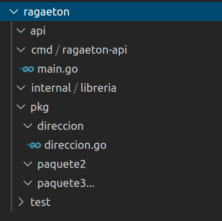

# Estructura a seguir

- El lenguaje que a usar es `GO`
- Se debe utilizar estructuras de proyectos mas de acuerdo para el desarrollo de una API

`Go` como tal no tiene un estándar a la hora de estructurar una app. Pero en distintos proyectos con go se denota un patrón que la comunidad sigue mas o menos de forma estándar, denominado como `cmd` + `pkg`.

Como referencia para la estructura se sigue las pautas indicadas por [friends of go](https://blog.friendsofgo.tech/posts/como_estructurar_tus_aplicaciones_go/) y de [ golang-standards](https://github.com/golang-standards/project-layout).  
Según el tipo de app que se quiera realizar la estructura sera, mas o menos parecida a lo que se propone a continuación.

Como por ahora estamos en una fase temprana tenemos este simple esquema de directorios

## cmd

Punto de entrada de la aplicación. corresponderá al main de la app

## pkg

componentes de la aplicación, que podrán ser totalmente funcionales fuera de ella.

## internal

Componentes de la aplicación privados de uso exclusivos para ella. parte "privada".

## test

Aplicaciones de pruebas.

## api

Archivos de esquema JSON, archivos de definición de protocolo..

## opcionales

- vendor: paquetes de terceros.  
mirar [go Modules](https://github.com/golang/go/wiki/Modules)